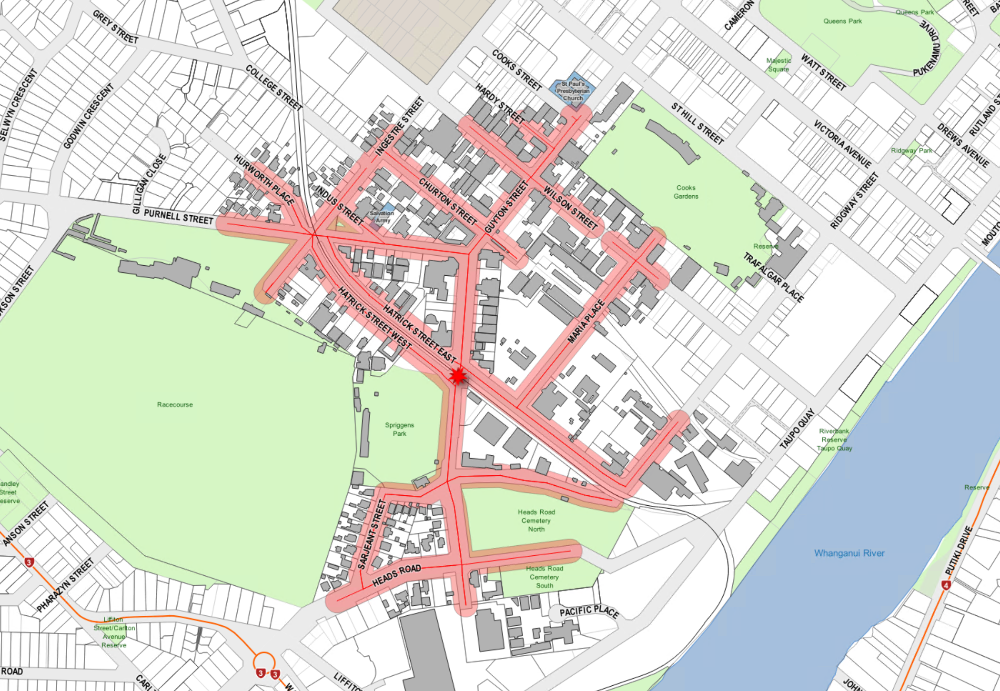
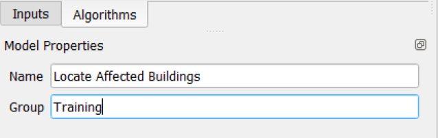

# Workshop Setup

## QGIS
- [ ] Ensure you have **QGIS 3.28** or better installed.

## Install Workshop Files

- [ ] Download the Workshop.zip file from  https://data.whanganui.govt.nz/wdc/foss4g/2023/Workshops.zip

- [ ] Unzip the contents to the folder **C:\Workshops**

  

## Run the Workshop Project

- [ ] *Double click* the QGIS project file **qgis_models_workshop.qgz** to run QGIS and open the workshop project

### Set additional path for python scripts
- [ ] From the **Settings** menu choose **Options**

- [ ] Select the **Processing** Panel

- [ ] Expand **Scripts**

- [ ] *Double click* the current path value for Scripts folder

- [ ] Click the **Options** button  on the left hand side of the path value

- [ ] Add the path to the workshops scripts folder e.g. **"C:\Workshops\scripts"**

  

- [ ] Click the **OK** button

- [ ] Click the **OK** button to exit the options dialog

---

---

# Processing Models

The objectives of this workshop are to learn about:

* Processing Models
* The Model Designer

---

## Processing Models and the Model Designer

The Model Designer is a powerful QGIS component that we can use to define a workflow that will run a chain of algorithms (a processing model).

A normal session with the Model Designer includes more than running a single algorithm. Usually several of algorithms are run to obtain a result, and often the outputs of some of those algorithms are used as input for other algorithms.

Using the Model Designer, that workflow can be put into a processing model, which will run all the necessary algorithms in a single run, thus simplifying the whole process and automating it.

---

---

## Locate Affected Buildings Model

In this workshop we will create a processing model in the Model Designer that displays buildings affected by a single point event within a distance from the event location.  

The affected buildings are determined by 
* Clicking a point on the map canvas to define an event location,
* travelling a distance along the road network from the event location, 
* buffering the travel distance to intersect land parcels, 
* extracting building footprints that then intersect the land parcels.

#### Inputs

-   Event location point chosen on the Map Canvas

-   Road network layer

-   Travel distance value

-   Travel distance buffer value

-   Land parcel layer

-   Building footprints layer

#### Outputs 

-   Event location point layer

-   Affected road network line layer

-   Travel distance buffer polygon layer

-   Affected buildings polygon layer

---

### Creating the model

- [ ] In the **Processing Toolbox**, click the **Models** tool 
  

- [ ] Choose **Create New Model...**
  
  

  Note that an empty **Model Designer** window opens
  

- [ ] In the **Model Properties** panel, set the **Name** to ***Locate Affected Buildings***

  
- [ ] In the **Model Properties** panel, set the **Group** to ***Training***

  

- [ ] Save the model by clicking the **Save** tool  on the Model Designer windows toolbar

    The **Save Model** dialog will be displayed...
    

- [ ] Set the File name to ***locate affected buildings.model3***
   
   For this workshop, set the save path for your model to…

   ***C:\Workshops***

- [ ] Click the **Save** button

---

## Adding the first Input parameter

Our first input parameter is the **Event Location (x,y)** point that will be chosen from the Map Canvas by the end user

- [ ] In the **Inputs** panel, *double click* the **Point** input

  

  Note that a **Point Parameter Definition** dialog opens...

  

- [ ] Set **Description** to ***Event Location (x,y)***

  
  
- [ ] Click the OK button

  Note that we now have the first input parameter in our Model Designer…

  
 
  > **HINT** - Any input parameter can be dragged in the window to re-position and to edit the input parameter simply *double click*.

---

### Adding the first algorithm and output
Our next task is to assign this input parameter to an algorithm

- [ ] Switch to the **Algorithms** panel (use the tabs at the bottom of the Inputs panel)

  Note that the panel now displays the different categories of algorithms available to the Model Designer…

  

- [ ] Expand the **Scripts** category, then expand **Custom scripts**

- [ ] *Double click* the **Pick point on map** script

  Note that a dialog opens for the **Pick point on map** script…

  

- [ ] Change the **Pick a point on the map** option to **Model Input**

  

- [ ] Set the **Pick a point on the map**  dropdown list for **Using model input** to **Event Location (x,y)** (that’s the input parameter we defined previously)

  

- [ ] Set **Output layer** to **Event location** (this will be the name of the output layer displaying the event location point in QGIS)

  

- [ ] Click the **OK** button

  Note that the Pick point on map script has been added to the Model Designer, along with the output layer…

  

- [ ] Re-position the items to look like below…

  

- [ ] Save the model by clicking the **Save** tool  on the toolbar

---

### Testing the model
We now have an input parameter, an algorithm and an output – let’s test the model.

- [ ] Close the **Model Designer** window

- [ ] In the **Processing Toolbox**, expand the **Models** category, then expand the **Training** group

  > **HINT** - *"agh! I dont see the training group!"* 
  >
  > - [ ] From the Settings menu choose Options
  > - [ ] Select the Processing Panel
  > - [ ] Expand Models
  > - [ ] Double click the current path value for Models folder
  > - [ ] Click the options button on the left hand side of the path value
  > - [ ] Add the path to where you saved your model e.g. "C:\Workshops"
  > - [ ] Click the OK button
  > - [ ] Click the OK button to exit the options dialog

  

- [ ] *Double click* the model named **Locate Affected Buildings**

  Note that **Locate Affected Buildings** dialog is displayed…

  

- [ ] Click the Option button  next to the **Event Location** textbox

  Note that we are switched to the Map Canvas and we can click a location for the event on the Map Canvas.

- [ ] Click a location as indicated below on the Map Canvas…

  

  The **Event location (x,y)** textbox will now be populated with the coordinates of the location we clicked on the Map Canvas...

  

- [ ] Leave the **Event Location** output set to **[Create temporary layer]**

- [ ] Click the **Run** button

  Note that the **Locate Affected Buildings** dialog swithces automatically to the log tab to display a log of the entire process that was run...

  

- [ ] In the **Locate Affected Buildings** dialog, click the **Close** button

  The **Map Canvas** should now show a point feature for the location we chose, and the **Layers Panel** will display a new temporary layer named **Event Location**…

  

---

### Edit the existing Model

- [ ] In the **Processing Toolbox**, expand the **Models** category, then expand the **Training** group

  

- [ ] *Right click* the model named **Locate Affected Buildings**, choose **Edit Model…** to open the Model Designer window

  

---

### Add input parameter for Road network layer
Let’s add the input parameter for the road network layer

- [ ] Switch to the **Inputs** panel (use the tabs at the bottom of the **Algorithms** panel)

  

- [ ] *Double click* the **Vector Layer** input

  Note that a **Vector Layer Parameter Definition** dialog opens...

  

- [ ] Set **Description** name to ***Road Network layer***

  

- [ ] Set **Geometry Type** to ***Line***

  

- [ ] Click the **OK** button

- [ ] Re-position the items to look like below…

  

- [ ] Save the model by clicking the **Save** tool  on the toolbar

---

### Add input parameter for Travel distance
Now let’s add the travel distance input parameter

- [ ] From the **Inputs** panel, *Double click* the **Number** input

  Note that a **Number Parameter Definition** dialog opens...

  

- [ ] Set **Description** to ***Travel Distance***

- [ ] Set **Minimum value** to ***1***

- [ ] Set **Maximum value** to ***10000***

- [ ] Set **Default value** to ***200***

  The **Number Parameter Definition** dialog should look like this...

  

- [ ] *Click* the **OK** button

- [ ] Re-position the items to look like below…

  

- [ ] Save the model by clicking the **Save** tool  on the toolbar

----

### Add algorithm for Service area (from point)
Now we'll add an algorithm that calculates the service area from the event location along our road network.

- [ ] Switch to the **Algorithms** panel (use the tabs at the bottom of the **Inputs** panel)

- [ ] In the **Algorithms** panel, type ***service*** in the search bar

  Note that the list of algorithms is automatically filtered as we type in the search value…

  

- [ ] *Double click* the **Service area (from point)** algorithm

  Note that the **Service area (from point)** properties dialog opens…

  

- [ ] Set **Vector layer representing network** to ***Road Network Layer***

- [ ] Set **Start point** to use the model input ***Event Location (x,y)***

- [ ] Set the **Travel cost** to use the model input ***Travel Distance***

- [ ] Set the **Service area (lines)** output to ***Affected Road Network***

  The **Service area (from point)** properties dialog should look like this...

  

- [ ] Click the **OK** button

- [ ] Re-position the items to look like below…

  

- [ ] Save the model by clicking the **Save** tool  on the toolbar

----

### Add input parameter for road network buffer
Now let’s add the input parameter for the road network buffer

- [ ] Switch to the **Inputs** panel (use the tabs at the bottom of the **Algorithms** panel)

- [ ] *Double click* the **Number** input

  Note that a **Number Parameter Definition** dialog opens...

  

- [ ] Set **Description** name to ***Travel Distance Buffer***

- [ ] Set **Minimum value** to ***1***

- [ ] Set **Maximum value** to ***1000***

- [ ] Set **Default value** to ***20***

  The **Number Parameter Definition** dialog should look like this...

  

- [ ] *Click* the **OK** button

- [ ] Re-position the items to look like below…

  

- [ ] Save the model by clicking the **Save** tool  on the toolbar

---

### Add algorithm for buffer
Now let’s add the buffer algorithm

- [ ] Switch to the **Algorithms** panel (use the tabs at the bottom of the **Inputs** panel)

- [ ] In the **Algorithms** panel, type ***buffer*** in the search bar

  

- [ ] *Double click* the QGIS **Buffer** algorithm

  Note that the **Buffer** properties dialog opens…

  

  
- [ ] Set **Input layer** to use the algorithm output ***'Service area (lines)' from algorithm 'Service area (from point)'***

- [ ] Set **Distance** to use the model input ***Travel Distance Buffer***

- [ ] Set the output layer **Buffered** to ***Travel Distance Buffer to Land***

  The **Buffer** properties dialog should look like this...

  

- [ ] *Click* the **OK** button

- [ ] Re-position the items to look like below…

  

- [ ] Save the model by clicking the **Save** tool  on the toolbar

---

### Add input parameter for land parcel layer
Now let’s add the input parameter for the land parcel layer

- [ ] Switch to the **Inputs** panel (use the tabs at the bottom of the **Algorithms** panel)

- [ ] *Double click* the **Vector Layer** input

  Note that a **Vector Layer Parameter Definition** dialog opens

  

- [ ] Set **Description** to ***Land Parcel Layer***

- [ ] Set **Geometry Type** to ***Polygon***

  The **Vector Layer Parameter Definition** dialog should look like this...

  

- [ ] Click the **OK** button

- [ ] Re-position the items to look like below…

  

- [ ] Save the model by clicking the **Save** tool  on the toolbar

---

### Add algorithm for extracting by location for land parcels
Now let’s add the extract by location algorithm

- [ ] Switch to the **Algorithms** panel (use the tabs at the bottom of the **Inputs** panel)

- [ ] In the **Algorithms** panel, type ***extract by*** by in the search bar

  

- [ ] *Double click* the **Extract by location** algorithm

  Note that the **Extract by location** properties dialog opens…

  

- [ ] Set **Extract features from** to the model input ***Land Parcel Layer***

- [ ] Set **Where the features (geometric predicate)** to ***intersect***

- [ ] Set **By comparing to the features from** to use the algorithm output ***'Buffered' from algorithm 'Buffer'***

  The **Extract by location** properties dialog should look like this...

  

- [ ] *Click* the **OK** button

- [ ] Re-position the items to look like below…

  

- [ ] Save the model by clicking the **Save** tool  on the toolbar

---

### Add input parameter for building footprints layer
Now let’s add the input parameter for the building footprints layer

- [ ] Switch to the **Inputs** panel (use the tabs at the bottom of the **Algorithms** panel)

- [ ] *Double click* the **Vector Layer** input

  Note that a **Vector Layer Parameter Definition** dialog opens

  

- [ ] Set **Description** to ***Buildings Footprints Layer***

- [ ] Set **Geometry Type** to ***Polygon***

  The **Vector Layer Parameter Definition** dialog should look like this...

  

- [ ] Click the **OK** button

- [ ] Re-position the items to look like below…

  

- [ ] Save the model by clicking the **Save** tool  on the toolbar

---

### Add algorithm for extracting by location for building footprints
Now let’s add the extract by location algorithm

- [ ] Switch to the **Algorithms** panel (use the tabs at the bottom of the **Inputs** panel)

- [ ] In the **Algorithms** panel, type ***extract by*** by in the search bar

  

- [ ] *Double click* the **Extract by location** algorithm

  Note that the **Extract by location** properties dialog opens…

  

- [ ] Set **Extract features from** to the model input ***Building Footprints Layer***

- [ ] Set **Where the features (geometric predicate)** to ***intersect***

- [ ] Set **By comparing to the features from** to use the algorithm output ***'Extracted (location)' from algorithm 'Extract by location'***

- [ ] Set **Extracted (location)** to ***Affected Buildings***

  The **Extract by location** properties dialog should look like this...

  

- [ ] *Click* the **OK** button

- [ ] Re-position the items to look like below…

  

- [ ] Save the model by clicking the **Save** tool  on the toolbar

---

### Running the model
We now have our processing model completed – let’s run the model.

- [ ] Close the **Model Designer** window

- [ ] In the **Layers** panel remove the layer named **Event Location** that was generated from our previous testing.

- [ ] In the **Processing Toolbox**, expand the **Models** category, then expand the **Training** group

  

- [ ] *Double click* the model named **Locate Affected Buildings**

  Note that the **Locate Affected Buildings** dialog is displayed…

  

- [ ] Set **Building Footprints Layer** to the layer ***building_footprints_urban_2020***

- [ ] Set **Event Location (x,y)** by clicking the Option button  next to the **Event Location** textbox

  Note that we are switched to the Map Canvas and we can click a location for the event on the Map Canvas.

- [ ] Click a location as indicated below on the Map Canvas…

  

- [ ] Set **Land Parcel Layer** to the layer ***land***

- [ ] Set **Road Network Layer** to the layer ***nz_road_addressing***

- [ ] Set **Travel Distance** to ***500***

- [ ] Set **Travel Distance Buffer** to ***20***

  The **Locate Affected Buildings** dialog will l;ook like this...

  

- [ ] Click the Run button

  Note that the **Locate Affected Buildings** dialog switches automatically to the log tab to display a log of the entire process that was run...

  

- [ ] In the **Locate Affected Buildings** dialog, click the Close button

The Map Canvas should now show the results of the **Locate Affected Buildings** processing model…

---

### Setting pre-defined styles for the output layers
Whenever the Affected Buildings model is run the output layers styles are determined randomly by QGIS.

We can extend our model by applying a QGIS **.qml** style file to each layer output so that we have consistent styling of the layer ouput each time we run the model.

For this workshop we have the following pre-defined style files available:

- **C:\Workshops\styles\AffectedBuildings_event_location.qml**
- **C:\Workshops\styles\AffectedBuildings_travel_distance_buffer.qml**
- **C:\Workshops\styles\AffectedBuildings_affected_road_network.qml**
- **C:\Workshops\styles\AffectedBuildings_affected_buildings.qml**

These style files define the following styles:

  

> >>>>>>>>>>>>>>>>>>>>>>>>>>>---
#### Let’s start editing our model

- [ ] In the **Processing Toolbox**, expand the **Models** category, then expand the **Training** group

  

- [ ] *Right click* the model named **Locate Affected Buildings**, choose **Edit Model…** to open the **Model Designer** window

  

> >>>>>>>>>>>>>>>>>>>>>>>>>>>---
#### Add the Event Location style

- [ ] In the **Algorithms** panel, type ***style*** in the search bar

  

- [ ] *Double click* the **Set layer style** algorithm

  Note that the **Set layer style** properties dialog opens…

  

- [ ] Set **Layer** to **'Output layer' from algorithm 'Pick point on map'**

- [ ] Set **Style file** to **C:\Workshops\styles\AffectedBuildings_event_location.qml**

  

- [ ] Click the **OK** button

- [ ] Re-position the items

- [ ] Save the model by clicking the **Save** tool  on the toolbar

> >>>>>>>>>>>>>>>>>>>>>>>>>>>---
####  Add the Affected road network style

- [ ] *Double click* the **Set layer style** algorithm

- [ ] Set **Layer** to **'Service area (lines)' from algorithm 'Service area (from point)'**

- [ ] Set **Style file** to **C:\Workshops\styles\AffectedBuildings_affected_road_network.qml**

  

- [ ] Click the **OK** button

- [ ] Re-position the items

- [ ] Save the model by clicking the **Save** tool  on the toolbar

> >>>>>>>>>>>>>>>>>>>>>>>>>>>---
#### Add the Travel distance buffer style

- [ ] *Double click* the **Set layer style** algorithm

- [ ] Set **Layer** to **'Buffered' from algorithm 'Buffer'**

- [ ] Set **Style file** to **C:\Workshops\styles\AffectedBuildings_travel_distance_buffer.qml**

  

- [ ] Click the **OK** button

- [ ] Re-position the items

- [ ] Save the model by clicking the **Save** tool  on the toolbar

> >>>>>>>>>>>>>>>>>>>>>>>>>>>---
#### Add the Affect buildings style

- [ ] *Double click* the **Set layer style** algorithm

- [ ] Set **Layer** to **'Extracted (location)' from algorithm 'Extract by location'**

> [!NOTE]
>
>  There are two **'Extracted (location)' from algorithm 'Extract by location'** options!
>
>  Choose the second one.

- [ ] Set **Style file** to **C:\Workshops\styles\AffectedBuildings_affected_buildings.qml**

  

- [ ] Click the **OK** button

- [ ] Re-position the items

- [ ] Save the model by clicking the **Save** tool  on the toolbar

> >>>>>>>>>>>>>>>>>>>>>>>>>>>---

Our model should look like this now…

---
### Running the final model with styling
We now have our processing model completed – let’s run the model.

- [ ] Close the **Model Designer** window

- [ ] In the **Layers** panel remove the layers from previous running of the model

  - Event Location
  - Affected road network
  - Travel distance buffer
  - Affected buildings

- [ ] In the **Processing Toolbox**, expand the **Models** category, then expand the **Training** group

  

- [ ] *Double click* the model named **Locate Affected Buildings**

  Note that the **Locate Affected Buildings** dialog is displayed…

  

- [ ] Set **Building Footprints Layer** to the layer ***building_footprints_urban_2020***

- [ ] Set **Event Location (x,y)** by clicking the Option button  next to the **Event Location** textbox

  Note that we are switched to the Map Canvas and we can click a location for the event on the Map Canvas.

- [ ] Click a location as indicated below on the Map Canvas…

  

- [ ] Set **Land Parcel Layer** to the layer ***land***

- [ ] Set **Road Network Layer** to the layer ***nz_road_addressing***

- [ ] Set **Travel Distance** to ***500***

- [ ] Set **Travel Distance Buffer** to ***20***

  The **Locate Affected Buildings** dialog will l;ook like this...

  

- [ ] Click the Run button

  Note that the **Locate Affected Buildings** dialog switches automatically to the log tab to display a log of the entire process that was run...

  

- [ ] In the **Locate Affected Buildings** dialog, click the Close button

The Map Canvas should now show the results of the **Locate Affected Buildings** processing model, complete with output layers styled…

---

### Editing model help
We can document our models from within the Model Designer itself.

To document our Locate Affected Buildings model, let’s start by editing our model

- [ ] In the **Processing Toolbox**, expand the **Models** category, then expand the **Training** group

  

- [ ] *Right click* the model named **Locate Affected Buildings**, choose **Edit Model…** to open the **Model Designer** window

  

Now let’s edit the model help

- [ ] In the Model Designer window, click the **Edit model help** tool 

  Note that **Edit Model Help** dialog opens…

  

- [ ] Select the element named **Algorithm description** in the **Select element to edit** panel

- [ ] Click inside the **Element Description** panel, and type a description for the model

> **TIP** – Copy and paste the text saved in the file **C:\Workshops\AffectedBuildings_help_text.txt** into the **Element Description** panel.

  

- [ ] Click the **OK** button

- [ ] Save the model by clicking the **Save** tool  on the toolbar

- [ ] In the Model Designer window, click the Run model tool  on the toolbar

  Note that the Model now displays a description panel on the right-hand side of the model dialog…

  

